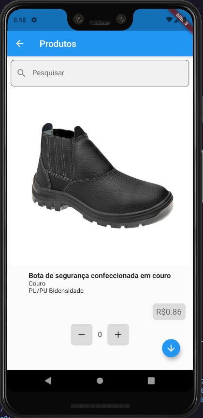

# Flutter List View Products Page

**Lista de Produtos**

### Tecnologia Utilizada:

#### Flutter

---

---

## Instalação | Execução

Clone esse repositório rodando o comando:

    git clone https://github.com/MarthinKorb/flutter_page_view_browser.git

---

# Sobre o ## Flutter

É um Framework de Dart para construir aplicações para a plataforma Android e Ios.

Quer saber mais sobre o _Flutter_? Acesse [https://flutter.dev/]

**Feito!** ✔

---
